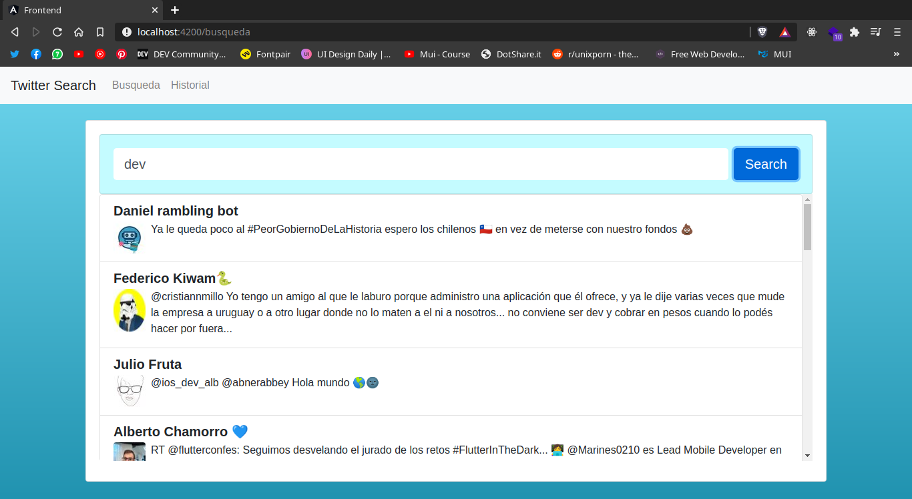

# Angular Twitter Search :bird: :rocket:
  Este test comprende las tecnologías Angular, Express, Sequelize y PostgreSQL. Se trata de una aplicación básica para poder buscar tweets segun palabras claves utilizando la API de Twitter.

  

## **Funcionalidades** :star2:
  
  - La app cuenta con 2 funcionalidades básicas:
    
    + Buscar tweets a traves de palabras claves
    + Ver todos las busquedas realizadas

## Para correr el proyecto seguir los siguientes pasos :bookmark_tabs:
  - REQUISITOS:
    - tener instalado PostgreSQL
  
  1. Clonar el repositorio
  2. Crea una base de datos en PostgreSQL con un nombre a eleccion. En este ejemplo le pondremos "twitter-search". Se crea con el siguiente comando: `CREATE DATABASE twitter-search;`
  3. Dentro de la carpeta `backend` crear un archivo `.env` con la siguiente información. Corregir los campos de USER y PASSWORD según corresponda.

```
  DB_USER=usuariodepostgres
  DB_PASSWORD=contraseñapostgres
  DB_HOST=localhost
  DB_NAME=TuContraseña12345

  TWITTER_CONSUMER_KEY=L34y0Ez744ifincFlkzqLus57
  TWITTER_CONSUMER_SECRET=c99M7ymvB5B74p16aAu70YZPbJaRx0VP48hW2UJoN8KNOs7hr8
  TWITTER_ACCESS_TOKEN_KEY=1104063783234879490-kY0DJFnHf29bT11WdvMspTqbGvHqST
  TWITTER_ACCESS_TOKEN_SECRET=DrHQf9AztSRwJPmDRXjURkFiLx8YmVM23A96C2Ac0xUwd
```

  4. Posicionarse en la carpeta `backend` y correr el comando `npm install`
   
  5. Posicionarse en la carpeta `frontend` y correr el comando `npm install`

  6. Correr los servers
  7. Abrir **dos** consolas
  8. En una consola posicionate en la carpeta `backend` y ejecuta el comando `npm start`
  9.  En la otra consola, posicionate en la carpeta `frontend` y ejecuta el comando `ng serve`
  10. !**LISTO**! La aplicacion debería estar corriendo en el puerto localhost:4200 :rocket:

## Tecnologías usadas

### Frontend
- Angular
- Bootstrap

### Backend
- Express
- Sequelize
- PostgreSQL
- Twit (librería para la API de twitter)